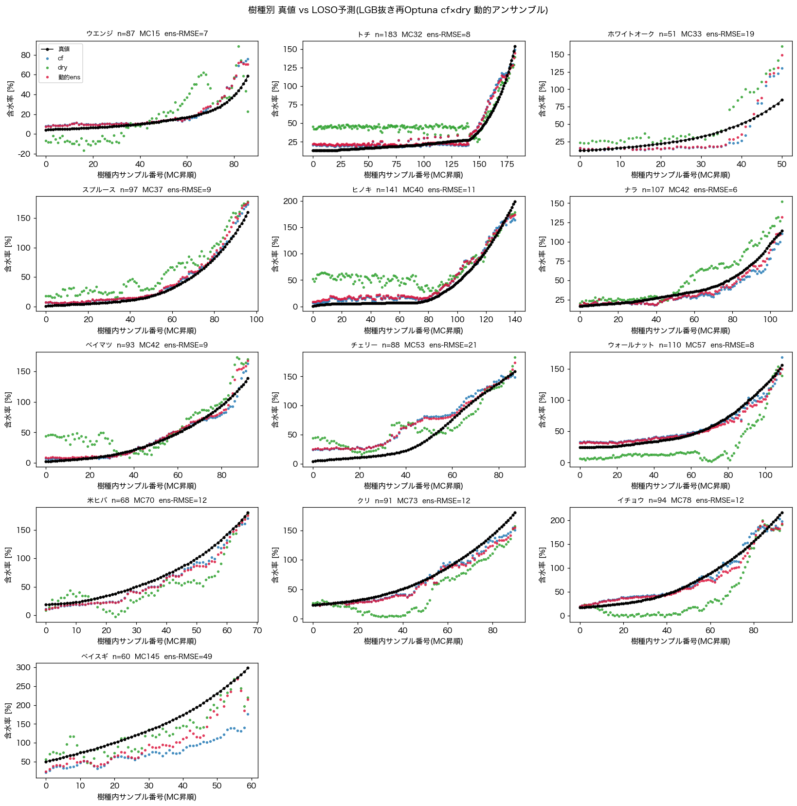

# nir-challenge

近赤外研究会 スペクトル分析チャレンジ　記録

木材の近赤外スペクトルから含水率(MC)を回帰予測するタスク。

## LOSO 検証結果

樹種単位の Leave-One-Species-Out (LOSO) で外挿性能を評価。

- **LOSO macro RMSE ≈ 14.2**（13樹種平均、特徴選択リークを避けた手順）

### 樹種別 RMSE

| 樹種 | n | MC帯 | ens-RMSE |
|---|---|---|---|
| ウエンジ | 87 | 15 | 7 |
| トチ | 183 | 32 | 8 |
| ホワイトオーク | 51 | 33 | 19 |
| スプルース | 97 | 37 | 9 |
| ヒノキ | 141 | 40 | 11 |
| ナラ | 107 | 42 | 6 |
| ベイマツ | 93 | 42 | 9 |
| チェリー | 88 | 53 | 21 |
| ウォールナット | 110 | 57 | 8 |
| 米ヒバ | 68 | 70 | 12 |
| クリ | 91 | 73 | 12 |
| イチョウ | 94 | 78 | 12 |
| ベイスギ | 60 | 145 | 49 |

- 低〜中MC帯は概ね RMSE 10 前後で安定。
- 誤差が大きいのは外挿が難しい高MC樹種で、特に **ベイスギ(MC145)** が支配的。

### 樹種別 真値 vs LOSO予測

黒=真値 / 青=cf / 緑=dry / 赤=動的アンサンブル（樹種内 MC 昇順）。

## 結果
最終順位は400位、、、

ただ、モデル推論の方向性は良かった。ハイパーパラメータのチューニングだけでメダル圏内から一気に順位が落ちてしまったので、評価方法などの選定に対する知見が深まった。
